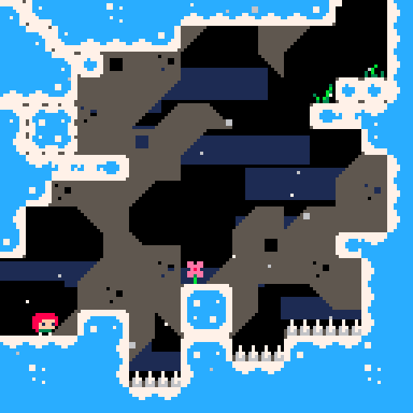

# ccleste4esp — Celeste Classic 移植到 ESP32-S3



将 **Celeste Classic**（PICO-8 原版《蔚蓝》）移植到 **ESP32-S3** 微控制器的项目，使用 ST7735R 128×128 LCD 和 GPIO 按键。

本项目的游戏引擎来自 [lemon32767/ccleste](https://github.com/lemon32767/ccleste)，它本身是用 C 语言逐行从 PICO-8 Lua 代码手工翻译的，不依赖任何标准库以外的代码，且不做动态内存分配。

---

## 目录结构

```
├── main.c                  # 程序入口 (ESP-IDF)
├── CMakeLists.txt          # 顶层 CMake
├── sdkconfig.defaults      # ESP32-S3 配置 (8MB Flash, 240MHz)
├── HARDWARE_NOTES.md       # 硬件连接/调试笔记 (中文)
│
├── main/                   # ESP32 应用代码
│   ├── main.c              # 初始化 + 游戏主循环
│   ├── CMakeLists.txt      # 组件注册
│   ├── esp32_frontend.c    # PICO-8 API 回调实现
│   ├── esp32_frontend.h
│   ├── font_data.h         # PICO-8 4×6 位图字体
│   │
│   ├── celeste/            # 游戏引擎 (源自 ccleste)
│   │   ├── celeste.c       # 全部游戏逻辑 (~2000 行)
│   │   ├── celeste.h       # PICO-8 回调接口
│   │   ├── sprite.h        # 精灵表单 (PICO-8 色号)
│   │   └── map_data.h      # 地图数据 (4×8 房间)
│   │
│   └── Drivers/            # 外设驱动
│       ├── LCD/            # ST7735R LCD (SPI DMA)
│       ├── button/         # 按键 (GPIO 上拉)
│       ├── LED/            # LED (GPIO48)
│       └── delay/          # 延时封装
│
└── ccleste/                # PC 参考实现 (子模块)
    ├── celeste.c/h         # 与 main/celeste 相同的游戏引擎
    ├── sdl12main.c         # SDL 前端
    └── data/               # 音频/精灵资源
```

---

## 硬件要求

| 组件 | 型号 |
|------|------|
| 主控 | ESP32-S3 开发板 |
| 屏幕 | ST7735R 1.44" 128×128 SPI TFT |
| 按键 | 6 个轻触按键 (左/右/上/下/跳/冲) |
| LED  | 任意 LED (可选) |

### 引脚连接

| LCD (ST7735R) | ESP32 GPIO |
|---------------|-----------|
| SCL (时钟)    | 14 |
| MOSI (数据)   | 13 |
| RES (复位)    | 12 |
| DC (数据/命令) | 11 |
| CS (片选)     | 10 |
| BLK (背光)    | 9  |

SPI 配置：`SPI2_HOST`, Mode 3, 80MHz, DMA 传输。

| 按键功能 | PICO-8 映射 | GPIO | 电气 |
|---------|------------|------|------|
| 左      | `k_left`  | 1    | 上拉输入, 低电平有效 |
| 上      | `k_up`    | 2    | 同上 |
| 右      | `k_right` | 3    | 同上 |
| 下      | `k_down`  | 4    | 同上 |
| 跳      | `k_jump`  | 5    | 同上 |
| 冲      | `k_dash`  | 6    | 同上 |

LED：GPIO 48, 低电平点亮。

---

## 编译与烧录

### 环境要求

- **ESP-IDF v5.4+** (项目基于 v5.4 / v6.0.1 开发)
- **CMake 3.16+**
- ESP32-S3 开发板

### 步骤

```bash
# 设置 ESP-IDF 环境 (以 Windows 为例)
set IDF_PATH=C:\esp\v6.0.1\esp-idf
set IDF_TOOLS_PATH=C:\Espressif\tools

# 编译
idf.py build

# 烧录 (修改 COM 端口)
idf.py -p COM8 flash

# 查看串口输出
idf.py -p COM8 monitor
```

也可直接运行提供的批处理文件（需先修改其中的路径和 COM 口）：

```batch
build_flash.bat
```

项目默认配置：
- 目标芯片：`esp32s3`
- Flash 大小：8MB
- CPU 频率：240MHz

---

## 游戏操作

| ESP32 按键 | 游戏动作 |
|-----------|---------|
| 左 / 右   | 移动 |
| 上        | 向上看 |
| 下        | 向下看 / 下穿平台 |
| 跳        | 跳跃 (按住可跳更高) |
| 冲        | 冲刺 (可空中冲刺) |

游戏自动以约 **30fps** (`delay_ms(33)`) 运行。暂无暂停功能（可考虑长按某键重启，与 ccleste 的 F9 对应）。

---

## 架构说明

### PICO-8 API 模拟

游戏引擎 (`celeste.c`) 不直接操作硬件。它通过函数指针 `Celeste_P8_cb_func_t` 调用前端实现的回调函数：

```c
// celeste.h 中定义的回调枚举
CELESTE_P8_SPR      // 绘制精灵
CELESTE_P8_BTN      // 按键输入
CELESTE_P8_PAL      // 调色板
CELESTE_P8_CIRCFILL // 画圆
CELESTE_P8_PRINT    // 文字渲染
CELESTE_P8_RECTFILL // 矩形填充
CELESTE_P8_LINE     // 画线
CELESTE_P8_MGET     // 读取地图
CELESTE_P8_MAP      // 绘制地图
CELESTE_P8_CAMERA   // 摄像头/视口
CELESTE_P8_FGET     // 精灵属性查询
CELESTE_P8_MUSIC    // 音乐 (空操作)
CELESTE_P8_SFX      // 音效 (空操作)
```

回调实现在 `esp32_frontend.c` 中，将 PICO-8 绘图命令翻译为 ST7735R framebuffer 操作。

### 帧渲染流程

```
app_main()
 ├── Celeste_P8_update()     ← 游戏逻辑更新 (物理/碰撞/AI)
 ├── Celeste_P8_draw()       ← PICO-8 API 绘制到显存
 └── celeste_render_finish() ← DMA 推送 framebuffer 到 LCD
      ├── __builtin_bswap16()   ← ESP32 小端 → ST7735 高字节优先
      ├── spi_device_polling_transmit() ← 128×128×16bit DMA 传输
      └── __builtin_bswap16()   ← 恢复字节序
```

### 精灵 Flag 系统

游戏使用 128 个 tile 的 flag 表定义物体属性：

| Flag 位 | 含义 | 示例 tile |
|---------|------|----------|
| bit 0 (1) | 固体 (solid) | 32-39, 48-55, 66-69, 72, 82-85, 98-101, 112-115 |
| bit 1 (2) | 背景层 | 大量 tile |
| bit 2 (4) | 冰面装饰 | 16, 40-42, 56-58, 88, 103-104 |
| bit 4 (16) | 真实冰面 | 66-69, 82-85, 98-101, 112-115 |

> 尖刺 (tile 17, 27, 43, 59) 不是固体，碰撞由 `spikes_at()` 单独检测。

---

## 已修复的移植问题

1. **P8fget 永远返回 true** → 添加 `sprite_flags[128]` 查找表
2. **按键未初始化** → 显式调用 `button_gpio_init()`
3. **P8spr 忽略 flipx/flipy** → 实现水平/垂直翻转
4. **P8print 空函数** → 实现 4×6 位图字体渲染
5. **P8pal 颜色替换无效** → 用 `pal_map[16]` 映射数组
6. **P8camera 空函数** → 实现视口偏移 + 震动衰减
7. **RGB565 公式/字节序/LCD 初始化序列** → 经过逐位测试最终确定

---

## 定点数模式 (TAS 回放)

PICO-8 实际使用 **16.16 定点数**而不是浮点数。对于普通游戏和速通，浮点与定点的差异可以忽略；但对于 TAS 回放则可能造成不同步。

游戏引擎 `celeste.c` 支持通过预处理器宏 `CELESTE_P8_FIXEDP` 切换到定点数模式（需要用 C++ 编译器编译 `celeste.c`）。详见 [ccleste 原项目 README](https://github.com/lemon32767/ccleste)。

---

## 致谢

- **原版 Celeste Classic** — Maddy Thorson & Noel Berry  
  [PICO-8 版本](https://www.lexaloffle.com/bbs/?tid=2145)
- **ccleste C 语言移植** — [lemon32767 (lemon-sherbet)](https://github.com/lemon32767/ccleste)  
  本项目的游戏引擎完全基于 ccleste 的 `celeste.c/h`
- **音频资源** — 音效来自 [Celeste-Classic-GBA](https://github.com/JeffRuLz/Celeste-Classic-GBA/tree/master/maxmod_data)，音乐由 PICO-8 WAV 导出转换

---

## 许可

本项目继承自 ccleste，延续其开源许可。详见 `LICENSE` 文件。
